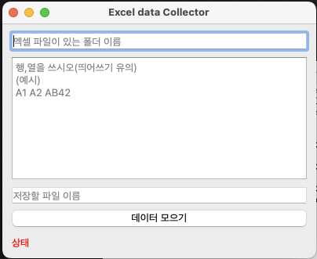
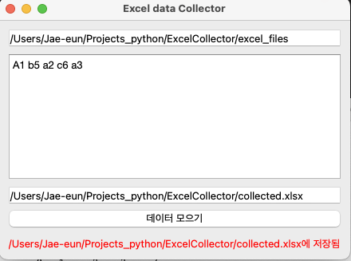

# ExcelCollector

A project requested by my friend for work purposes

***
## 실행 방법

### 1. EXE파일
- dist 폴더에 있음.
- 맥에서 테스트해서 잘 실행이 될지 확실치 않음.

### 2. 첫번째 에디터 창
- excel 파일이 있는 폴더를 full directory 로 적어줌.

### 3. 두번째 에디터 창
- A1 b5 a2 c6 a3 이런식으로 가져올 데이터 위치를 적어줌
- 대소문자 예외 처리만 했음.

### 4. 세번째 에디터 창
- Full directory + 새롭게 만들 파일 이름.xlsx 

### 5. 데이터 모으기 버튼
- 실행 버튼
- 몇가지 오류는 아래부분에 빨간색으로 상태가 적혀지게 했음.

### 6. 텍스트 저장 기능
- 모든 에디터 창은 '데이터 모으기' 버튼을 누르면 저장되게 했음
- 툴을 다시 시작할때 로드됨.

------

## Python 설치 및 빌드 방법

### 1. 파이썬 설치 
 - 인터넷 검색해서 알아서... (뭘 찾아도 방법 자세히 나옴)
 - 설치 종류가 많은데, 이거는 아무걸로나 해도 될듯
   (예: Python 자체 사이트, Anaconda, brew, pyenv, .....)
 - 버전 : 3.12가 최신인데, 최신 받으면 될 듯

### 2. 환경변수 설정
 - 이것도 설치하려고 검색한 곳에서 나올텐데, Dos에서 python이라는 명령어를 쓰기 위한 거야

### 3. Pip 로 라이브러리 설치
 - python 환경 설정이 잘 됐으면 pip라는 명령어도 동작할거야. 아래와 같은 명령어로 확인 가능
    - python --verion
    - pip --version
 - 필요한 라이브러리 설치
  pip install pandas openpyxl PyQt5 pyinstaller

    pandas 데이터 처리 라이브러리
    openpyxl 엑셀 읽어오는 라이브러리
    PyQt5 UI 그려주는 라이브러리
    Pyinstaller  exe 파일로 build 해주는 라이브러리

### 4. 수정할 코드
 - collector.py : window UI를 그리는 부분
 - functions.py : 주요 기능. 엑셀 읽고, 쓰는 부분

### 5. python 파일 실행 커맨드
 - python collector.py

### 6. exe 파일 만들기
 - pyinstaller --onefile --noconsole collector.py
 - dist 폴더에 exe파일이 나옴
